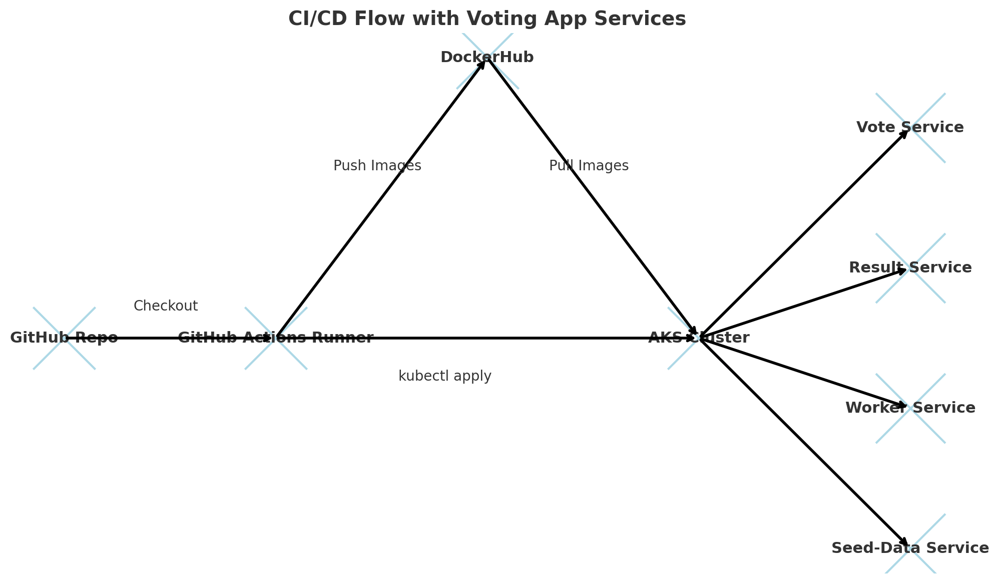
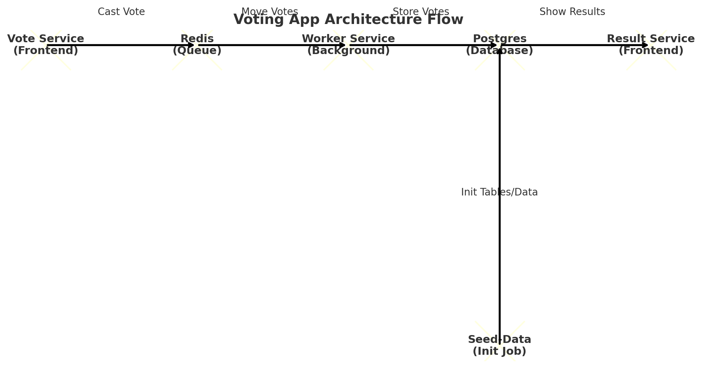

# Voting App Deployment (GitHub Actions + AKS)

This project demonstrates deploying a **microservices-based Voting App** to Azure Kubernetes Service (AKS) using **GitHub Actions CI/CD pipeline**.

---

## CI/CD Pipeline Flow

The pipeline builds Docker images, pushes them to DockerHub, and deploys them to AKS.

---

## Voting App Architecture

The Voting App has 5 components:
- **Vote Service**: Frontend where users cast votes.
- **Result Service**: Frontend showing results.
- **Worker Service**: Moves votes from Redis → Postgres.
- **Seed-Data Job**: Initializes Postgres with schema/data.
- **Redis + Postgres**: Queue + Database.

---

## Workflow Summary

1. Code pushed to GitHub → triggers GitHub Actions.
2. Docker images for Vote, Result, Worker, and Seed-Data are built and pushed to DockerHub.
3. GitHub Actions updates the AKS cluster with new images.
4. The cluster pulls images and runs them as Pods.
5. The Worker service ensures votes flow from Redis → Postgres.
6. Result service displays live vote counts.
